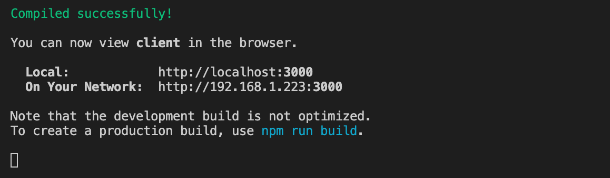

### To start server:

1. Open **new** terminal window and go to the project directory
2. Add the following line to the terminal and press enter:

```
npm start
```
If the server was started successfully you should see a similar message:


#### To stop server:

1. In the same terminal where the server is running press `command` + `C`

### To start client:

1. Open **new** terminal window and go to the project directory
2. Add the following line to the terminal and press enter:

```
cd client
```
3. Add the following line to the terminal and press enter:
```
npm start
```
If the client was started successfully you should see a similar message:



#### To stop client:

1. In the same terminal where the client is running press `command` + `C`

### To start postgres:


### To start redis:

