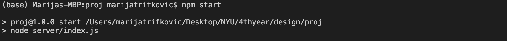

## Software Engineering Fall 2021 Final

This is a design for a social media platform "Cohort" that would be used by universities to enroll their students into groups based on their class rosters and would help students stay connected and be able to easily find all of the required course related information in one place. It's built on top of Node.js and PostgreSQL.

## Instructions:
### To start server:

1. Open **new** terminal window and go to the project directory
2. Add the following line to the terminal and press enter:

```
npm start
```
If the server was started successfully you should see a similar message:



#### To stop server:

1. In the same terminal where the server is running press `command` + `C`

### To start client:

1. Open **new** terminal window and go to the project directory
2. Add the following line to the terminal and press enter:

```
cd client
```
3. Add the following line to the terminal and press enter:
```
npm start
```
If the client was started successfully you should see a similar message:


#### To stop client:

1. In the same terminal where the client is running press `command` + `C`

### To start postgres:

[Setting up a PostgreSQL Database on Mac](https://www.sqlshack.com/setting-up-a-postgresql-database-on-mac/)

Assuming you have installed Postgres:

1. Open **new** terminal window
2. Add the following line to the terminal and press enter:

```
brew services start postgres
```

#### To stop postgres:

```
brew services stop postgres
```

### To start redis:

[Session Management in Node.js Using Redis as Session Store](https://codeforgeek.com/using-redis-to-handle-session-in-node-js/#installation)

Assuming you have installed Redis:

1. Open **new** terminal window
2. Add the following line to the terminal and press enter:
```
redis-server &
``
